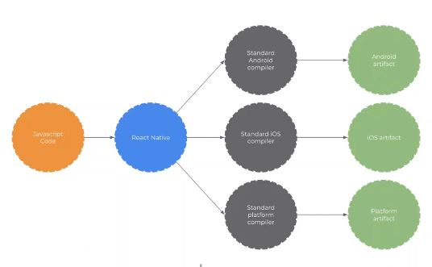

# react-native_practice
#### 웹에 아예관심 없던 제가react-native를 시작하게되어서  react-native, expo.io를  처음 시작해보는 저장소입니다 
- 개발할때 유용한 배경색 https://uigradients.com/#Sylvia

>자주 발생 하는 오류 해결 방법================================================

error 일어날시 node_modules -> src ->defaults ->blacklist.js의 내용  변경(아래와 같이)

<code>var sharedBlacklist = [ </code>

<code>/node_modules[\/\\]react[\/\\]dist[\/\\].*/,</code>

<code>/website\/node_modules\/.*/,</code>

<code>/heapCapture\/bundle\.js/,</code>

<code>/.*\/__tests__\/.*/</code> 

<code>];</code>

- 자세한 링크 https://stackoverflow.com/questions/58120990/how-to-resolve-the-error-on-react-native-start

## 그 후 ./gradlew clean 실행 in root folder

### unable to load script. make sure you're either running a metro server error occur: Resolve method is react-native start -> ctrl+c -> npx react-native run-android  

## Task :app:transformNativeLibsWithMergeJniLibsForDebug FAILED : Resolve method is    cd android-> ./gradlew clean -> cd .. ->npx react-native run- android 

>========================================================================

### 잊으면 안되는 간단한 react StudyNote 📖
- react-native란 javaScript로 어플리케이션을 만들수 있는 프레임워크
- 활용 사례는 인스타그램 스카이프 페이스북 디스코드 등.

react-native의 구조 :

- 웹 페이지가 있을때 html은 웹페이지의 뼈대를 구성 css는 웹페이지의 보여지는 부분 및 UI, javascript는 동적인 움직임을 부여 

- ECMA는 JAVAscript와 다른언어를 포함한 표준안.
- let으로는 변수를 선언만 할수있지만 const는 불가능 const는 데이터값을 변경시킬수는없음.
- function안에서 this는 전역객체를 가르키고 객체안에서 this는 그 객체를 가르킴.
- arrow function이라는 기능이 추가되어 이는 예시를 들면 다음과 같은 뜻. Es6부터는 arrow권장

> const a123 = function(a,b){
  return a+b
}

> const a1234 = (a,b) => {
  return a+b 
}

- JSX라는 새로운 표현식의 등장으로 
 <code>const mystr= "hello"  </code> 하였던 것을
<code>const mystr2 = <,h2> hello </,h2> </code>으로도 표현이 가능해짐 

- class component 

<code>class App extends React.Component{
  render(){
    return  hello, {this.props.name} ;
  }
} 
name="junseong"
</code>  > 이렇게 할시에 hello, junseong이 표시 

- 항상 constructor실행후에 render() 실행 JSX를 붙이는 과정을 mount라고함. component가 mount된이후에는 componentDidMount()실행. 간단한 componentDidMount() 예제는 https://velog.io/@odini/Rendering-Elements 참고

- state는 특정 고정값이 아닌 계속변하는값. props는 변경이 불가능한값. 지속적인 변화가 필요할시에 state를쓰자.
-class만이 state를 다룰 수 있음.
- LinearGradient https://docs.expo.io/versions/v34.0.0/sdk/linear-gradient/

- navigator https://reactnavigation.org/
- react-native 6.0이상부터는 gesture-handler link 안해도됨.
- 순수 react-native vectorIcon https://github.com/oblador/react-native-vector-icons

