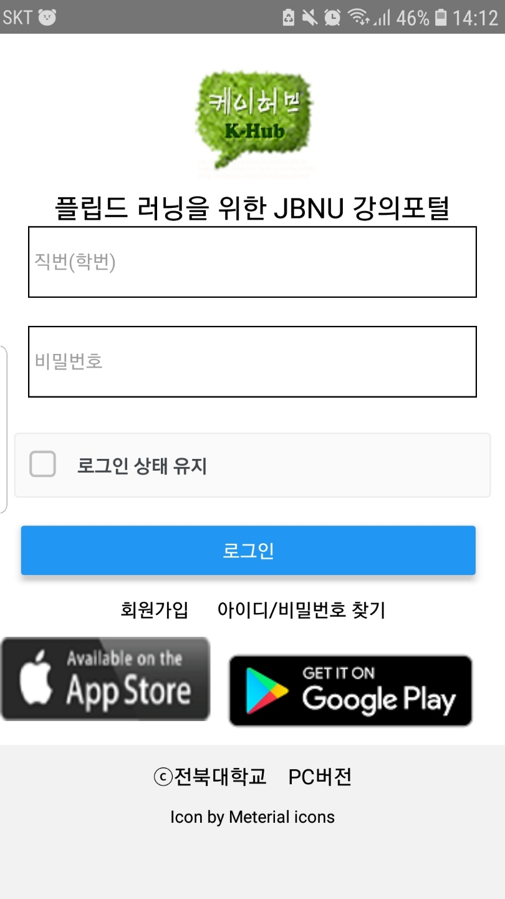
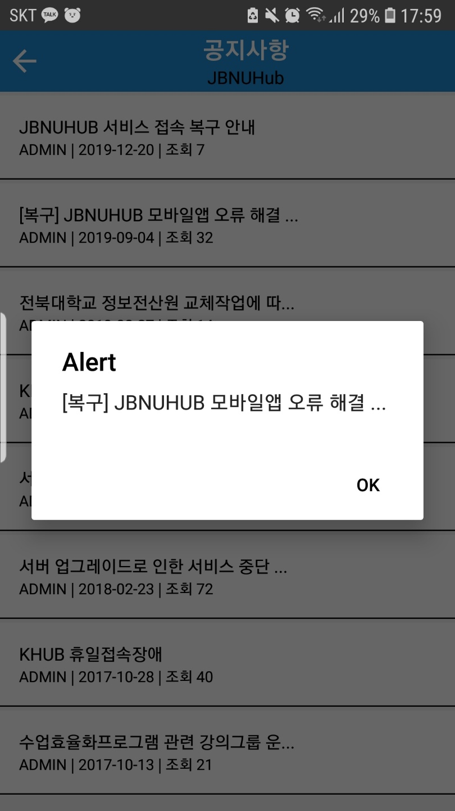
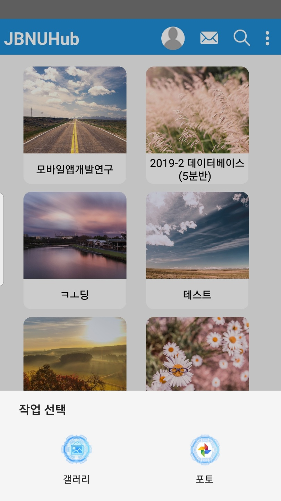
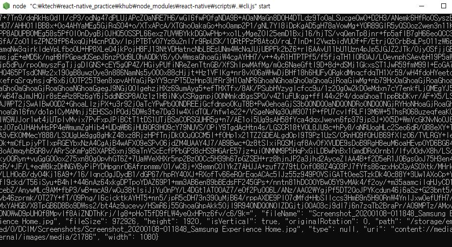

### khub clone coding 
-  react-native vectorIcon https://github.com/oblador/react-native-vector-icons
- react-native modal https://github.com/react-native-community/react-native-modal
- react-natvie random number https://reactnativecode.com/generate-random-number/
- react-native-extra-dimensions-android https://github.com/Sunhat/react-native-extra-dimensions-android

#### (2020.01.08) 현재 앱스토어와 구글플레이 배지크기는 맞지않지만 다른 버튼들은 제대로 링크와 연동되어 동작함 

### 2020 01 09 완전하드코딩으로 공지사항까지;; 

### 2020 01 10 리눅스 + go언어하다가 뒤늦게 react-native 프로필아이콘 바꾸는것 해보려다가
- imagepicker로 접근은 가능함 but 아이콘이 바뀌질않는데 react문법몰라서 막힌상황

 

- 파일을 잘불러오긴함  react관련 어케해ㅑ할지 모르겟음 

